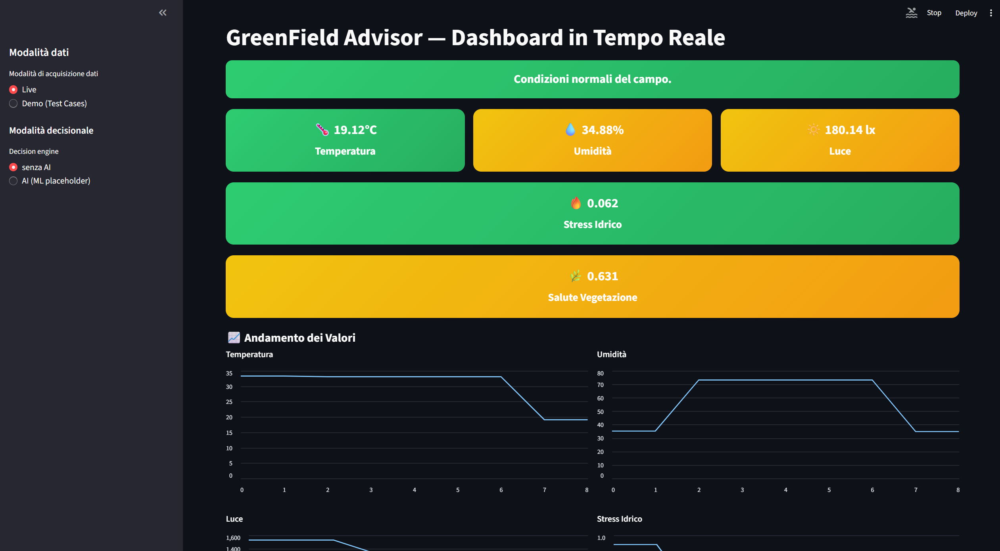
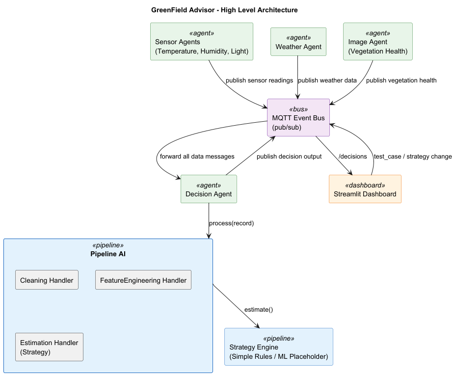
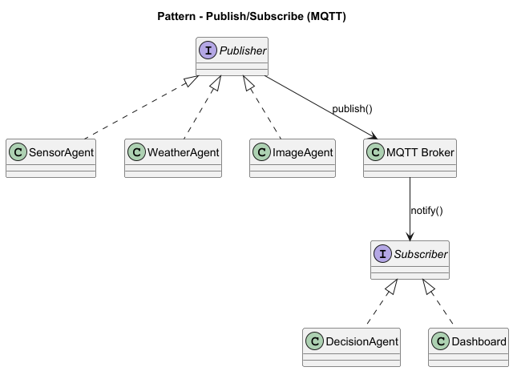
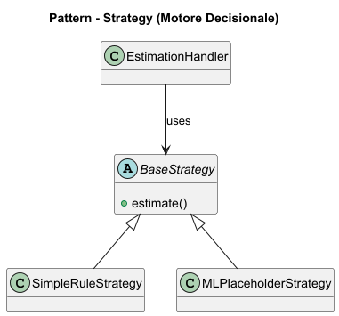
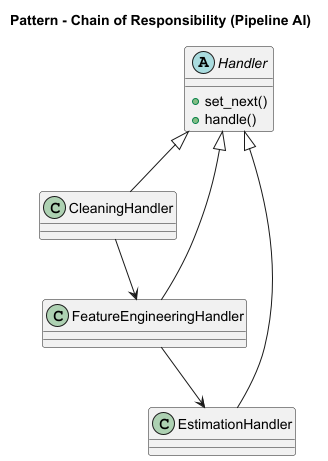

# **GreenField Advisor — Agent-based Decision Support System**

GreenField Advisor è un **sistema didattico modulare basato su agenti** che simula un contesto agricolo intelligente,
integrando **sensori ambientali**, **condizioni meteo**, **feature derivate da immagini** (salute della vegetazione)
e un **modulo decisionale**.

I dati vengono elaborati tramite una **pipeline decisionale** basata su  
**Chain of Responsibility** (*cleaning → feature engineering → estimation*),  
con **strategie intercambiabili** (**Strategy Pattern**) e comunicazione asincrona
tramite **Observer Pattern** su **MQTT**.

È disponibile una **dashboard interattiva in Streamlit** e un’integrazione opzionale con **n8n**
per l’orchestrazione dei flussi decisionali.

---

## 🖥️ **Dashboard in esecuzione**



La dashboard Streamlit consente di:
- monitorare in tempo reale i valori dei sensori simulati
- visualizzare indici derivati (es. *vegetation health*)
- osservare le decisioni generate dal sistema

---

## **Requisiti**

- Python **3.10+**
- Broker **MQTT** (es. Mosquitto) su `localhost:1883`
- **Streamlit** (dashboard)
- *(Opzionale)* **n8n** per orchestrazione e webhook

---

## **Clonazione del progetto**

Repository GitHub:

```bash
git clone https://github.com/LeonardoDaCodice/greenfield-advisor.git
cd greenfield-advisor
````

---

## **Installazione Mosquitto (Windows) — Download + PATH**

Per eseguire `mosquitto` da terminale (es. `mosquitto -v`) è necessario:

1. Scaricare Mosquitto dal sito ufficiale:
   [https://mosquitto.org/download/](https://mosquitto.org/download/)

2. Verificare che la cartella di installazione sia inclusa nel **PATH**.

### Percorso tipico di installazione

```
C:\Program Files\mosquitto
```

### Aggiunta al PATH (Windows)

1. Pannello di Controllo → Sistema → Impostazioni di sistema avanzate
2. Variabili d’ambiente → Variabili di sistema → `Path`
3. Aggiungi:

   ```
   C:\Program Files\mosquitto
   ```
4. Riavvia il terminale

### Verifica

```bash
mosquitto -h
```

---

## **Installazione progetto**

```bash
python -m venv venv
venv\Scripts\activate
pip install -r requirements.txt
cp .env.example .env
```

---

## **Avvio rapido (simulazione locale)**

### Terminale 1 — Avviare Mosquitto

```bash
mosquitto -v
```

### Terminale 2 — Avviare gli agenti

```bash
venv\Scripts\activate
python -m src.app.main
```

### Terminale 3 — Avviare la dashboard Streamlit

```bash
streamlit run streamlit_app\app.py
```

---

## 🔧 **Orchestrazione con n8n (opzionale)**

1. Importare il workflow: `n8n/greenfield_webhook_demo.json`
2. Impostare `N8N_WEBHOOK_URL` nel file `.env`
3. Il `DecisionAgent` invierà le decisioni al webhook configurato

---

## **Pattern architetturali principali**

### High-Level Architecture



### Observer Pattern (MQTT)



### Strategy Pattern



### Chain of Responsibility



I diagrammi UML completi sono disponibili in formato **PlantUML** nella cartella `docs/`.

---

## **Documentazione tecnica**

La documentazione tecnica completa del progetto è disponibile qui:

- [Documentazione_Tecnica.pdf](docs/technical_report/Documentazione_Tecnica.pdf)

---

## **Presentazione del progetto**

Le slide utilizzate per la presentazione del progetto sono disponibili qui:

- [Presentazione.pptx](docs/presentation/Presentazione.pptx)

---

## **Estensione a sensori reali**

I sensori simulati possono essere sostituiti da **ESP32 / Arduino** con pubblicazione MQTT,
senza modifiche all’architettura.
Analogamente, l’`ImageAgent` può essere rimpiazzato da un servizio reale di **Computer Vision**
(drone o camera fissa) che pubblica feature aggregate
(es. indici di salute della vegetazione).

---

© 2025 — **GreenField Advisor**
Progetto didattico di Ingegneria del Software / AI & Data Science


